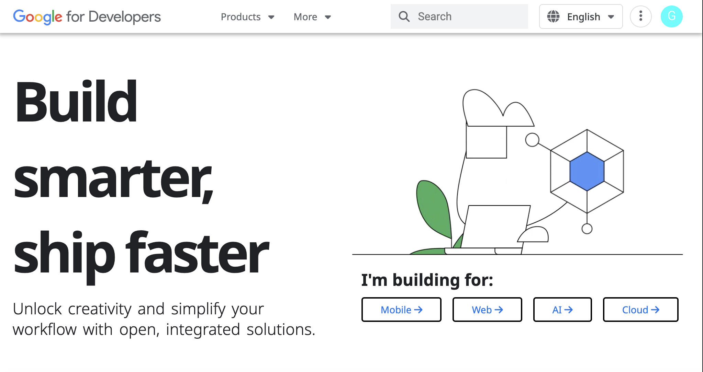
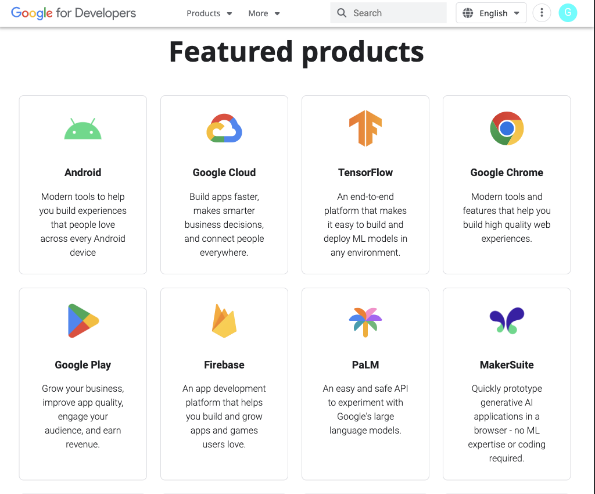
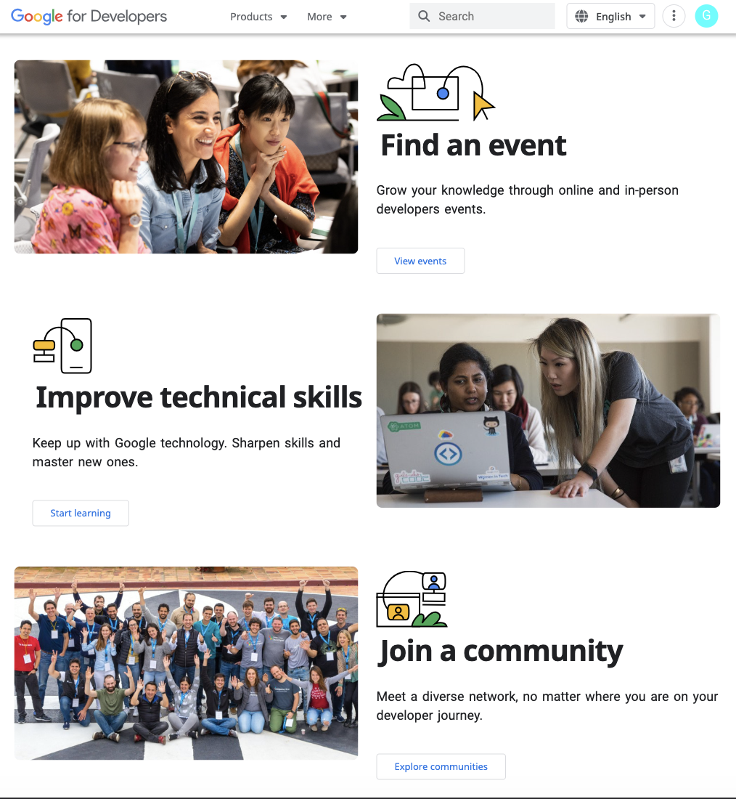
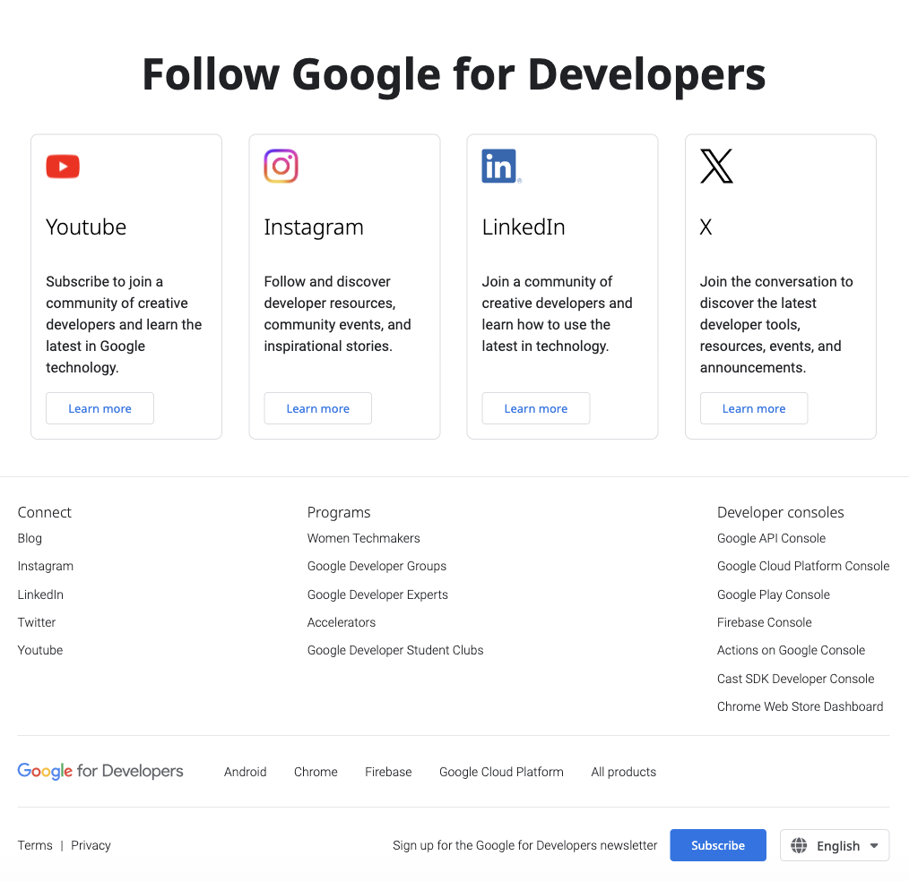

# Google Developers Page Mockup

This project is a responsive website, with optimal layout for mobile, tablet and desktop. The goal of this project is to make the website look as close as[Google Developers Page](https://developers.google.com/?hl=en)

## Table of contents

- [Overview](#overview)
  - [The function](#the-function)
  - [Screenshot](#screenshot)
- [My process](#my-process)
  - [Built with](#built-with)
  - [Continued development](#continued-development)

## Overview

### The function

Users are able to:

- View the optimal layout for the site depending on their device's screen size

### Screenshot

Desktop Layout

Header

Featured Products

Activities

Social Media Section & Footer

## My process

### Built with

- Semantic HTML5 markup
- CSS custom properties
- Flexbox
- Mobile-first workflow

### Continued development

Despite my best effort, there are still numerous features left uncompleted at this moment.

- Navigation: dropdown links and their hover effects.

- The News Carousel

Hopefully, I could develop these above two features very soon.

Also, some parts still look amiss right now and need more polishing.

- The Android News Section: the image and content proportion still seems off visually.

- The CSS is kind of a mass now. It's hard to read and unorganized. Rewrite in the future.

Any feedback or advice is highly welcomed!
